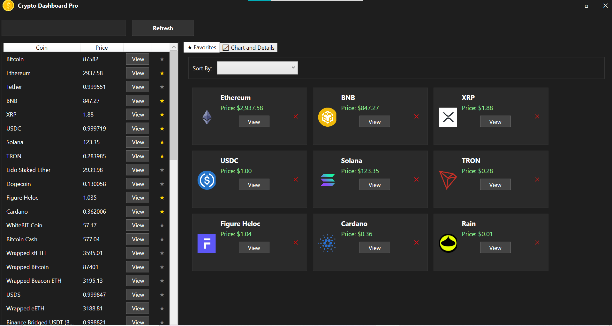
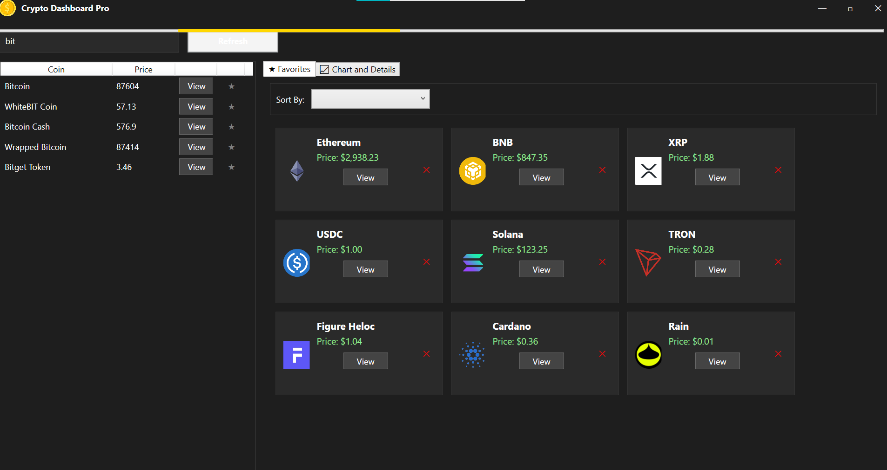
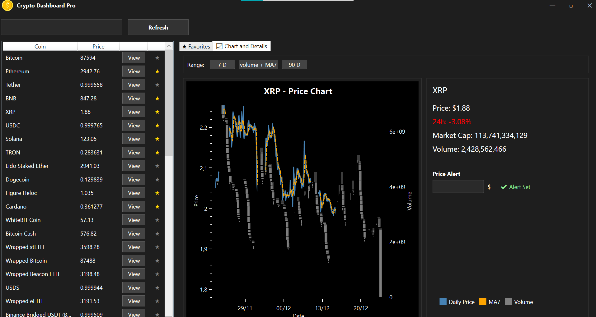
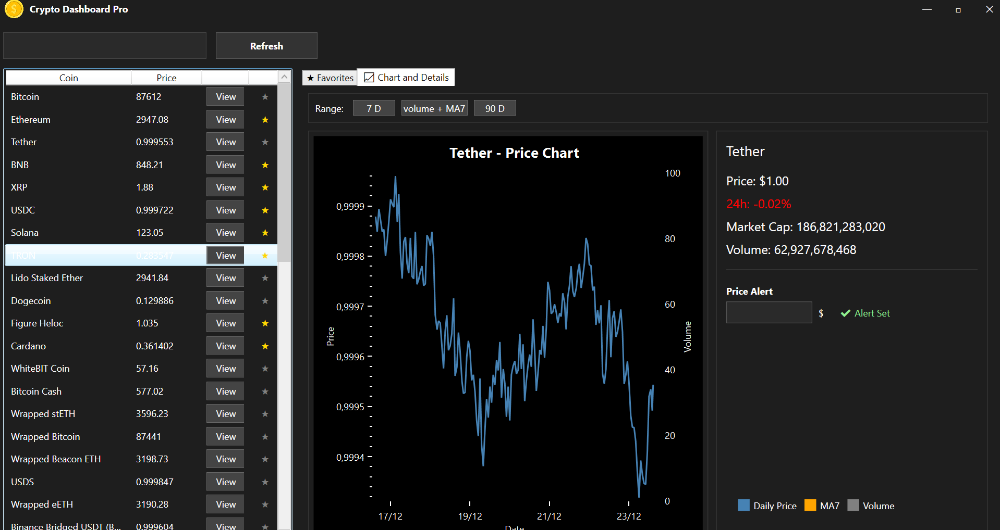

# CryptoDashboard
CryptoDashboard is a **desktop application** built with **WPF (.NET)** that allows users to track cryptocurrencies in real-time. It provides features such as price monitoring, favorite coins, 30-day charts with moving averages, volume, and alerts. The app is designed with a **MVVM architecture**, ensuring clean separation between UI, logic, and data management.
API Provider: CoinGecko API
-------------------------------------------------------------------------------
## Screenshots
### Main Window

### Search

### 30 day chart

### 7 day chart

## Features

- Display a list of cryptocurrencies with current prices.
- Add/remove favorite coins.
- View detailed coin information, including:
  - Current price
  - 24h price change
  - Market cap
  - Volume
  - Price alerts
- 30-day price chart with:
  - Daily price
  - MA7 (7-day moving average)
  - Volume bars
- 7-day price change chart for short preview.
- 90-day price change chart for a bigger view on history.
- searching the list of coins.
- Sort and filter favorite coins by diffrent criteria.
- Responsive UI with custom title bar and theming.
- Refresh coins list from API.
- Toaster notifications for events/alerts.
- Logger on api requests

----------------------------------------------------------------------------------
## Architecture
CryptoDashboard follows the **MVVM (Model-View-ViewModel)** pattern:

### Models
The `Models` folder contains classes representing the core data structures:
- **Coin.cs** – represents a cryptocurrency with properties like `Name`, `CurrentPrice`, `ImageUrl`, `IsFavorite`.
- **CoinDetails.cs** – contains detailed coin information such as price change, market cap, volume, and alerts.

### ViewModels
The `ViewModels` folder manages the application state and logic:
- **MainViewModel.cs** – central VM connecting Views and Models.
- **CoinViewModel.cs** – handles individual coin logic (favorite toggle, alerts).
- Commands for button actions like refresh, show details, and set alerts.

### Views
The `Views` folder contains WPF XAML files:
- **MainWindow.xaml** – main UI with:
  - Left: coin list
  - Right: tabs for Favorites and Chart/Details
  - Top bar: search and refresh
- **Custom controls** for charts, buttons, and toaster notifications.

### Services
The `Services` folder handles data fetching and processing:
- **CoinGeckoService.cs** – communicates with the CoinGecko API to fetch coin data.
- Data is parsed into Models and updated in the ViewModels.

### Helpers
The `Helpers` folder contains utility classes:
- Converters (e.g., `PriceColorConverter` for coloring price changes)
- Other helper functions for logging, toaster,  etc.

---

## Getting Started
### Prerequisites
- Windows OS
- Visual Studio 2022 or later
- .NET 7.0 SDK (Windows Desktop)
- WPF support enabled
- NuGet Package:
  - `OxyPlot.Wpf` v2.2.0 (for rendering charts)
- Icon resource: `Assets/coin.ico`

### Installation
1. Clone the repository:
   ```bash
   git clone https://github.com/Aicha-khorchani/CryptoDashboard.git
